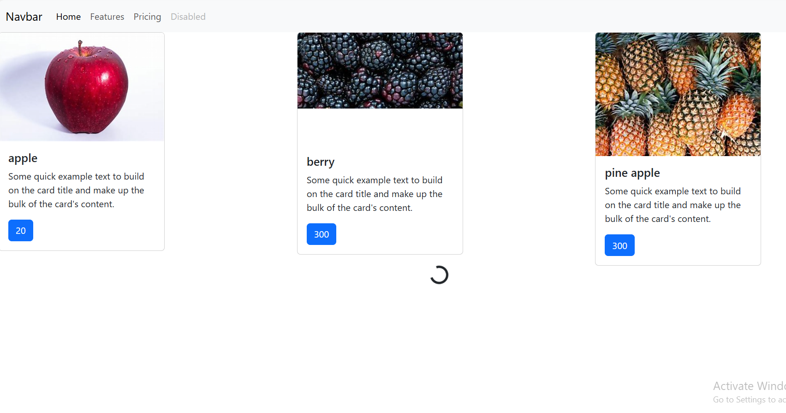

# PyShop Setup

## Prerequisites
- Install Anaconda.

## Setup Instructions

1. Create a virtual environment using Anaconda.
2. Activate the environment and install Django:
    ```bash
    conda create --name myenv
    conda activate myenv
    pip install django
    ```

3. Create a new Django project:
    ```bash
    django-admin startproject market
    ```

4. Navigate into the project directory and run the server:
    ```bash
    cd pyshop
    python manage.py runserver
    ```

5. Create a new app inside the project:
    ```bash
    python manage.py startapp shop
    ```

6. To migrate models to SQLite3, use:
    ```bash
    python manage.py makemigrations
    python manage.py migrate
    ```

7. Create a superuser to access the admin panel:
    ```bash
    python manage.py createsuperuser
    ```
## Screenshot


